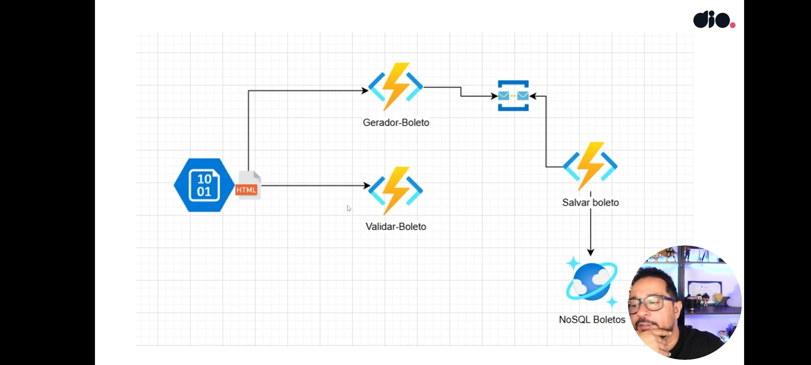

# azure-cloud-native-04
Criando um Serviço Autenticador de Boletos
o Projeto visa criar um app de serviço que gera e valida boletos, através do azure functions e código ccharp. O primeiro serviço transforma a data de validade e o valor a ser pago, via postagem,em um código de barras de 44 digitos e um código gerador de imagem base64. O segundo serviço valida se o código está correto ou não. a estrutura do projeto está a seguir:

